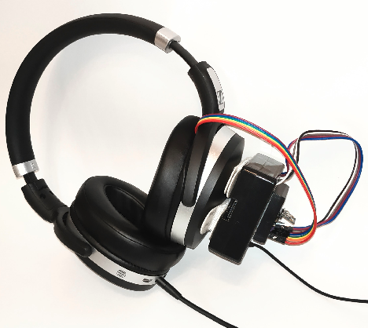
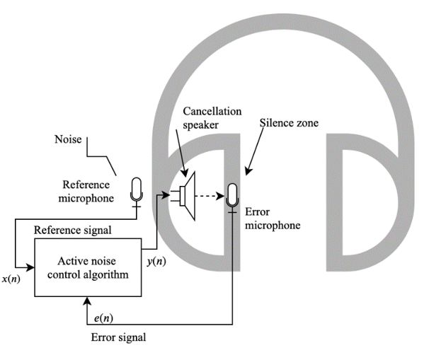

# RpiANC

Implementation of Active Noise Control Algorithms for Raspberry Pi.

This is the accompanying code to the publication 'Adaptive Active Noise Cancelling System for Headphones on Raspberry Pi Platform'
that will be presented at the Signal Processing Workshop 2020 conference https://mrweek.org/spw/


## Used hardware
* Raspberry Pi 3 Model A+

* Two Tiny MEMS Microphones - https://www.adafruit.com/product/3421

* On-ear headphones connected via 3.5mm jack







## Build and run commands

Example:
```
mkdir build && cd build
cmake ../ && make all
```

Main binary that does feedforward active noise control:
```
./ffANC
```

Simple tests that show how LMS and FxLMS attenuate simulated noise on matplotlib plots:
```
./lmstest
./fxlmstest
```

## Build dependencies 

Builds tested on Ubuntu 18.04 and Raspbian distributions:
```
Cmake >= 3.7
Alsa library, so packages like: libasound2, libasound2-dev.
Python2.7 libraries (matplotlibcpp dependency) so packages like: python-dev
OpenMP directives (propably supported by your compiler)
```


## Repository and code structure

Cmake and make commands build a few binaries. The main one, is the `ffANC` binary that executes tha main function from
the [feedforward_anc.cpp](Mains/feedforward_anc.cpp) file. Inside this file you can define  or remove the DEPLOYED_ON_RPI
macro to change devices used for capture and playback. Define CAP_MEASUREMENTS macro to capture sample values and save
them to files.

The main function of the `ffANC` target executes a specified number of loop iterations. During each iteration 3 main
operations: capture of new samples, sample processing and playback of the calculated samples, are executed concurrently,
in a fork-join model. Firstly, each of the 3 operations is executed in a separate thread. Then, output samples from each
operation are exchanged. Most recently calculated output samples are moved to the input array of the playback function
and newly captured samples are moved to the input array of the signal processing function.


In [constants.h](Headers/constants.h) file, you can find the names of devices used on Raspberry Pi and other constants used in signal processing.

All signal processing is in the header files under the [Headers](Headers)
and the [processing.cpp](Sources/processing.cpp) source file.

[Scripts](Scripts) directory contains python and bash scripts that automate measurements, gathering data, deploying code etc.


## Useful links, articles, etc.

* [Microphone wiring and connection guide](https://learn.adafruit.com/adafruit-i2s-mems-microphone-breakout/raspberry-pi-wiring-test#wiring-for-stereo-mic-3061608-5)
* [Introduction to Sound Programming with ALSA](https://www.linuxjournal.com/article/6735)
* [A Tutorial on Using the ALSA Audio API](http://equalarea.com/paul/alsa-audio.html)
* [Rpi I2S thread](https://www.raspberrypi.org/forums/viewtopic.php?t=91237)
* [Implementation of FIR Filtering in C](https://sestevenson.wordpress.com/implementation-of-fir-filtering-in-c-part-1/)


## Included third-party libraries

This software uses matplotlibcpp - see matplotlibcpp-license.txt
